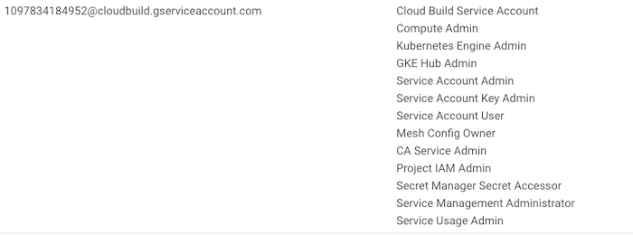

 

# A Simple Anthos Installer

A Customizable Anthos Multi Cloud installer framework. Great for quickly setting up a Demo or POC.

**Note: This is not an officially supported Google product.**

<br/>

# CloudBuild Instructions

Clone the repo 
```bash
git clone https://github.com/GoogleCloudPlatform/simple-anthos-installer
```

## Roles

- Ensure the following roles for the Cloud Build Service account:



Or go YOLO and give it Owner privilege (not recommended)

## Cloud Build Container image
We need to build the container image used for our Cloud Build deploy to use. This is one time step which will store the container image in GCR in your project and will be used to create our infrastructure. The container image has gcloud, terraform, terragrunt, install_asm dependencies and aws-cli installed. 

```bash

cd cloudbuild/simple-anthos-build
gcloud builds submit --config=cloudbuild.yaml

```

## Build the CloudBuild container image

```bash
# Clone the repo
git clone https://github.com/GoogleCloudPlatform/simple-anthos-installer

cd simple-anthos-installer

# Setup Project Env variables
export PROJECT_ID="<GCP_PROJECTID>"
gcloud config set core/project ${PROJECT_ID}  

# Specify the ACM repo to use. You can clone this one https://github.com/GoogleCloudPlatform/csp-config-management
export ACM_REPO="git@github.com:your-git-repo/csp-config-management.git"

# Build the Cloud Build container image which will store the image in your project GCR 
cd cloudbuild/simple-anthos-build
gcloud builds submit --config=cloudbuild.yaml
```

## Create GKE resources

```bash
###### GKE Cluster ######
# Create the GKE Cluster with Workload Identity, GKE Connect(Hub) and ACM enabled.
cd ../..
gcloud builds submit . --config=cloudbuild-gke-deploy.yaml --timeout=30m --substitutions=_ACM_REPO=$ACM_REPO
```

## Create EKS resources

```bash
#####  EKS Cluster ######
# Setup AWS credentials in Secrets Manager
printf $AWS_ACCESS_KEY_ID | gcloud secrets create aws-access-key --data-file=-
printf $AWS_SECRET_ACCESS_KEY | gcloud secrets create aws-secret-access-key --data-file=-

# Replace the REPLACE_WITH_PROJECT_ID string with your GCP project since Cloud Build does not yet support parameterizing secret paths
sed -i 's@REPLACE_WITH_PROJECT_ID@'"$PROJECT_ID"'@' cloudbuild-eks-dev-deploy.yaml

# Create the EKS Cluster connected with GKE Connect(Hub) and ACM enabled.
gcloud builds submit . --config=cloudbuild-eks-deploy.yaml --timeout=30m --substitutions=_ACM_REPO=$ACM_REPO

```
This will create 2 clusters named `gke-dev-01` and `eks-dev-01` in GKE and EKS respectively connected to GKE Hub. 


<br/>
<br/>

## Detailed Explanation of above
### AWS Credentials

In order to create AWS resources the AWS Account credentials are stored in Secrets Manager. 

Sample script to store the creds.

```bash
# Setup AWS credentials in Secrets Manager
printf $AWS_ACCESS_KEY_ID | gcloud secrets create aws-access-key --data-file=-
printf $AWS_SECRET_ACCESS_KEY | gcloud secrets create aws-secret-access-key --data-file=-
```

### Update project path in cloudbuild-eks-dev-deploy.yaml for secrets to work

CloudBuild has made it [easier to access secrets](https://cloud.google.com/build/docs/securing-builds/use-secrets#configuring_builds_to_access_the_secret_from) but the GCP `PROJECT_ID` parameter is not configurable and hence needs to be changed in the build yaml.

Modify the following section below to reflect the PROJECT_ID where the AWS credentials are stored.

```yaml
availableSecrets:
  secretManager:
  - versionName: projects/REPLACE_WITH_PROJECT_ID/secrets/aws_access_key_id/versions/latest
    env: 'AWS_ACCESS_KEY_ID'
  - versionName: projects/REPLACE_WITH_PROJECT_ID/secrets/aws_secret_access_key/versions/latest
    env: 'AWS_SECRET_ACCESS_KEY'
```

```bash
# Replace the REPLACE_WITH_PROJECT_ID string with your GCP project since Cloud Build does not yet support passing environment variables in secret paths
sed -i 's@REPLACE_WITH_PROJECT_ID@'"$PROJECT_ID"'@' cloudbuild-eks-dev-deploy.yaml
```

## Cleanup
```bash
gcloud builds submit . --config=cloudbuild-eks-dev-destroy.yaml --timeout=30m

gcloud builds submit . --config=cloudbuild-gke-dev-destroy.yaml --timeout=30m
```

