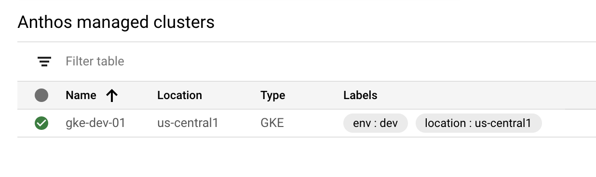
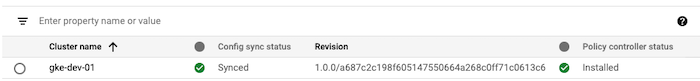
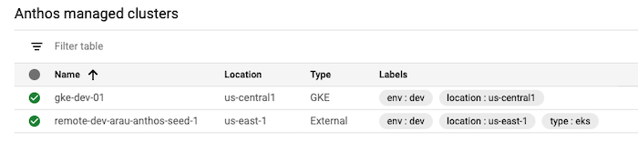
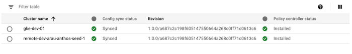

# A Simple Anthos Installer

A GitOps based Anthos Multi Cloud installer framework. 

**Note: This is not an officially supported Google product.**

## 🥅  Goals 
- Provide starter scripts to install Anthos components with minimal manual steps.
- Use [CFT](https://cloud.google.com/foundation-toolkit) Terraform modules that follow GCP best practices.
- Adding/modifying/removing Anthos/GCP components should be painless.
- Use of small modules so each one can be deployed and debugged independently
- GitOps enabled.
  

# ❓ What can it Install? 
 
- A Regional GKE Cluster on GCP in a dedicated VPC with [Workload Identity](https://cloud.google.com/kubernetes-engine/docs/how-to/workload-identity), [GKE Connect](https://cloud.google.com/anthos/multicluster-management/connect/overview), [Anthos Config Management (ACM)](https://cloud.google.com/anthos/config-management) and [Anthos Service Mesh (ACM)](https://cloud.google.com/service-mesh/docs/overview) enabled.

- An EKS Cluster on AWS in a dedicated VPC with [GKE Connect](https://cloud.google.com/anthos/multicluster-management/connect/overview) and [Anthos Config Management (ACM)](https://cloud.google.com/anthos/config-management) enabled. Also creates a Kubernetes Service Account to use to login to the GCP console.

# 🚀 Quickest Quickstart 

The quickest way to get an environment without installing any tools except git and gcloud is to use CloudBuild. See [README-CloudBuild.md](README-CloudBuild.md) for details.
<br/>
<br/>

# 🤓  Quickstart (tested on Linux)
Install gcloud, Terraform, Terragrunt, awscli (if EKS required). Check the [pre-requisites](#pre-requisites)  


## 🖥️  Prepare
```bash
# Clone the repo
git clone https://github.com/GoogleCloudPlatform/simple-anthos-installer
cd simple-anthos-installer

# Make sure authenticate with Application default login as this required for the google provider. See https://registry.terraform.io/providers/hashicorp/google/latest/docs/guides/provider_reference#authentication
gcloud auth application-default login # Mandatory

# Setup Project Env variables
export PROJECT_ID="<GCP_PROJECTID>" # Mandatory
gcloud config set core/project ${PROJECT_ID}  # Mandatory

export GCP_REGION="gcp-region"  # Optional, Defaults to us-east1
export GCP_AZS="az-1,az-2" # Optional. Defaults to us-east1-b,us-east1-c,us-east1-d

# Install kpt tool required for ASM install
sudo apt-get install google-cloud-sdk-kpt
# Specify the ACM repo to use. You can clone this one https://github.com/GoogleCloudPlatform/csp-config-management
export ACM_REPO="git@github.com:your-git-repo/csp-config-management.git" # Mandatory if using ACM

```
## Create the GKE Resources
```bash
# Create the GKE Cluster with Workload Identity, GKE Connect(Hub), ACM and ASM enabled.
cd terragrunt/gke-gcp
terragrunt run-all apply --terragrunt-non-interactive
```

##  Create EKS Resources
```bash

# Setup AWS credentials 
export AWS_ACCESS_KEY_ID="aws-secret-key-id" # Mandatory
export AWS_SECRET_ACCESS_KEY="aws-secret-key" # Mandatory
export AWS_REGION="aws-region" # Optional. Defaults to us-east-1


# Create the EKS Cluster connected with GKE Connect(Hub) and ACM enabled.
cd terragrunt/eks-aws
terragrunt run-all apply --terragrunt-non-interactive

```
This will create 2 clusters named `gke-dev-01` and `eks-dev-01` in GKE and EKS respectively connected to GKE Hub. 

<br/>
<br/>

# Detailed Instructions

<!-- toc -->
- [A Simple Anthos Installer](#a-simple-anthos-installer)
  - [🥅  Goals](#--goals)
- [❓ What can it Install?](#-what-can-it-install)
- [🚀 Quickest Quickstart](#-quickest-quickstart)
- [🤓  Quickstart (tested on Linux)](#--quickstart-tested-on-linux)
  - [🖥️  Prepare](#️--prepare)
  - [Create the GKE Resources](#create-the-gke-resources)
  - [Create EKS Resources](#create-eks-resources)
- [Detailed Instructions](#detailed-instructions)
- [Pre-requisites](#pre-requisites)
  - [Local Machine](#local-machine)
  - [GCP Requirements](#gcp-requirements)
  - [Clone (or create) a git repo you want to use for ACM](#clone-or-create-a-git-repo-you-want-to-use-for-acm)
- [Detailed Usage](#detailed-usage)
  - [1. Create GKE Cluster on GCP](#1-create-gke-cluster-on-gcp)
    - [ACM](#acm)
    - [ASM](#asm)
  - [2. Create EKS Cluster on AWS](#2-create-eks-cluster-on-aws)
    - [Login to the Cluster in GCP Console](#login-to-the-cluster-in-gcp-console)
    - [ACM](#acm-1)
  - [Enjoy!](#enjoy)
  - [Cleanup](#cleanup)
- [Customization and Extending](#customization-and-extending)
  - [GKE Directory Structure](#gke-directory-structure)
    - [To change the region:](#to-change-the-region)
    - [Modify/Add a New Environment:](#modifyadd-a-new-environment)
  - [AWS Directory Structure](#aws-directory-structure)
  - [Terraform State](#terraform-state)
- [Development and Testing](#development-and-testing)
  - [Validating the scripts](#validating-the-scripts)
  - [Incrementally building the infrastructure](#incrementally-building-the-infrastructure)
- [Known Issues](#known-issues)
- [Contributing](#contributing)
- [References](#references)
- [Related Projects](#related-projects)
- [Licence](#licence)

<!-- tocstop -->
<br/>
<br/>

# Pre-requisites
## Local Machine 

- Terraform 0.13.x
- Terragrunt 0.28.x
- gcloud
- awscli
- [gcloud](https://cloud.google.com/sdk/docs/install) installed and configured with a GCP project.

  
```bash
export PROJECT_ID="<GCP_PROJECTID>"
gcloud config set core/project ${PROJECT_ID}  
```
- kpt installed using `sudo apt-get install google-cloud-sdk-kpt` see [this](https://github.com/GoogleCloudPlatform/anthos-service-mesh-packages/tree/master/scripts/asm-installer#prerequisites-for-install_asm) for more details. You may need to install the other tools manually depending on how gcloud was installed.
## GCP Requirements

- Following APIs are Enabled:
  - Compute
  - Cloud Build
  - Kubernetes
  - Anthos
  - Secrets Manager (to store AWS credentials)
  

## Clone (or create) a git repo you want to use for ACM

By default it uses the reference repo [git@github.com:GoogleCloudPlatform/csp-config-management.git](https://github.com/GoogleCloudPlatform/csp-config-management)

To change this to use your own repo, clone the above [repo](https://github.com/GoogleCloudPlatform/csp-config-management) and modify the `sync_repo` variable in the  files  [gke-gcp/us-central1/dev/5_acm/terragrunt.hcl](gke-gcp/us-central1/dev/5_acm/terragrunt.hcl#51) and [eks-aws/us-east-1/dev/5_acm/terragrunt.hcl](eks-aws/us-east-1/dev/5_acm/terragrunt.hcl#80) to point to your repo.

<br/>


# Detailed Usage

## 1. Create GKE Cluster on GCP
From the root git folder

```bash
cd terragrunt/gke-gcp
terragrunt run-all apply --terragrunt-non-interactive
```

Go get some ☕ and if all goes well, in about 20 minutes, you should see this on the Anthos console in the Clusters view:




### ACM 

You will need to configure the cluster's ACM SSH public key on your git config management repo you created [earlier](#clone-or-create-a-git-repo-you-want-to-use-for-acm). The install script outputs a value `git_creds_public` which is the public key to use with you git provider.

Once you have updated the SSH public key successfully, in the Anthos Config Management screen, you should see the following:


### ASM

You will have to enable sidecar injection into the namespaces you want by following the directions here: https://cloud.google.com/service-mesh/docs/scripted-install/gke-install#deploying_and_redeploying_workloads

  
## 2. Create EKS Cluster on AWS 

```bash

# Setup AWS credentials 
export AWS_ACCESS_KEY_ID="aws-secret-key-id"
export AWS_SECRET_ACCESS_KEY="aws-secret-key"


# Create the EKS Cluster connected with GKE Connect(Hub) and ACM enabled.
cd terragrunt/eks-aws
terragrunt run-all apply --terragrunt-non-interactive

```

### Login to the Cluster in GCP Console
  
In order to see the EKS cluster details in the Anthos Dashbaord, you have to [Login to the Cluster](https://cloud.google.com/anthos/multicluster-management/console/logging-in#login) using a KSA token.

Go to the Cloud Build output for the EKS Hub module and look for the output value for `ksa_token`. Use this token to Login to the GCP console from the Kubernetes Clusters page. 

### ACM 
Follow the steps from GKE [above](#acm) to enable ACM

<br/>

## Enjoy!

Now you have a 2 clusters connected to an envrion (your GCP project) with ACM enabled. 






## Cleanup
```bash
# From terragrunt/eks-aws or terragrunt/gke-gcp directory
cd terragrunt/eks-aws
terragrunt run-all destroy --terragrunt-non-interactive --terragrunt-ignore-dependency-errors
```

The above cleanup will fail deleting the vpc if your project adds additional firewall rules that this script did not create which will prevent the VPC from being deleted. Easier way would be to use a dedicated project and delete the project when you are finished with it.


# Customization and Extending

[Terragrunt](https://terragrunt.gruntwork.io/) is used to call the CFT Terraform modules as it simplifies dependency management and makes use of DRY pattern.

This project creates a dev environment 
## GKE Directory Structure 

The `terragrunt/gke-gcp` directory is structured as follows:

```bash
├── account.hcl
└── us-east1
    ├── dev
    │   ├── 0_activate-apis
    │   │   └── terragrunt.hcl
    │   ├── 1_vpc
    │   │   └── terragrunt.hcl
    │   ├── 2_gke
    │   │   └── terragrunt.hcl
    │   ├── 3_hub
    │   │   └── terragrunt.hcl
    │   ├── 4_acm
    │   │   └── terragrunt.hcl
    │   ├── 5_asm
    │   │   └── terragrunt.hcl
    │   └── env.hcl
    └── region.hcl
```

It is organized by region (us-east1 in this case) and under that an environment (dev). 

- `account.hcl` : contains GCP project details
- `region.hcl` : contains GCP region and AZ details
- `env.hcl` : environment name set to `dev` by default

These `.hcl` provide sensible defaults which can be overriden using environment variables.

The numbering scheme for the directories is a best practice to document the order of deployment.

### To change the region:
 - Change `region` variable in the [region.hcl](gke-gcp/us-central1/region.hcl)  
 - Rename the directory `us-central1` to your desired region. This has no effect on the code. This is for purely documenting your code to reflect the region.

### Modify/Add a New Environment:
- Change `environment_name` variable in the [env.hcl](gke-gcp/us-central1/dev/env.hcl)  
- Copy the directory `dev` and rename it to your desired environment name. Reanming the directory has no effect on the code. This is for purely documenting your code to reflect the environment. It is best practice to name the directories (region and environment) to the same as the one in the `.hcl` files.


## AWS Directory Structure 
The `terragrunt/aws-eks` directory is structured as similarly:

```bash
├── account.hcl
└── us-east-1
    ├── dev
    │   ├── 1_vpc
    │   │   └── terragrunt.hcl
    │   ├── 2_eks
    │   │   └── terragrunt.hcl
    │   ├── 3_hub
    │   │   └── terragrunt.hcl
    │   ├── 4_hub_login
    │   │   └── terragrunt.hcl
    │   ├── 5_acm
    │   │   └── terragrunt.hcl
    │   └── env.hcl
    └── region.hcl
```

## Terraform State 

The Terraform state is stored in GCS bucket with the naming convention `terraform-state-dev-$PROJECT_ID-$REGION`. The directory structure will match the directory structure above.
# Development and Testing

## Validating the scripts

From the `gke-gcp` or `eks-aws` directory run:

```bash
terragrunt run-all validate
```

A `terragrunt plan` can be done but it needs to be done separately in each numbered folder since there are dependencies in the some of the modules that needs to exist for a `plan` command to work.

## Incrementally building the infrastructure

You can deploy all the infrastructure for a specific cloud provider or one module at a time.  

From a numbered directory `(1_xx)` or its parent, run:

```bash
terragrunt run-all apply --terragrunt-non-interactive
```

# Known Issues

- Clean Upgrade and Uninstall of ASM is not supported as the asm install scripts do not support this yet. See https://github.com/GoogleCloudPlatform/anthos-service-mesh-packages/issues/480
- Install of ASM is not supported for non GKE clusters.
- There are some Cloud Build scripts, you read the instructions [here](README-CloudBuild.md)

# Contributing

Bug reports and feedback welcome. Please see [CONTRIBUTING.md](CONTRIBUTING.md)

# References
Videos: 
- [Automated, modularized and versioned infrastructure with Terraform and Terragrunt](https://youtu.be/sOK-dJ20u04)
- [5 Lessons Learned From Writing Over 300,000 Lines of Infrastructure Code](https://youtu.be/RTEgE2lcyk4)


# Related Projects
- [anthos-multicloud-workshop](https://gitlab.com/anthos-multicloud/anthos-multicloud-workshop)
  
# Licence 
Apache 2.0
