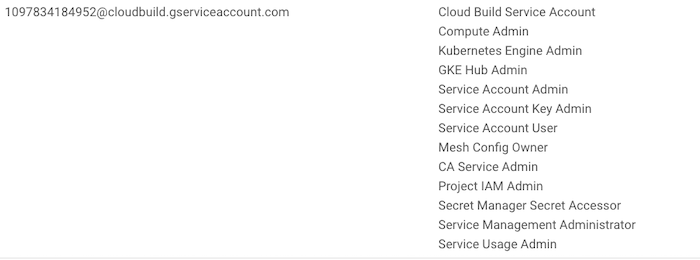

# A Simple Anthos Installer

An Automated and Configurable Anthos Multi Cloud installer framework. Great for quickly setting up a Demo or POC.

## Goals 
- Provide starter scripts to install Anthos components with minimal manual steps.
- Use [CFT](https://cloud.google.com/foundation-toolkit) Terraform modules that follow GCP best practices.
- Adding/modifying/removing Anthos/GCP components should be painless.
- Use of small modules so each one can be deployed and debugged independently
  

# What can it Install?
 
- A GKE Cluster on GCP in a dedicated VPC with [Workload Identity](https://cloud.google.com/kubernetes-engine/docs/how-to/workload-identity), [GKE Connect](https://cloud.google.com/anthos/multicluster-management/connect/overview) and [Anthos Config Management (ACM)](https://cloud.google.com/anthos/config-management) enabled.

- An EKS Cluster on AWS in a dedicated VPC with [GKE Connect](https://cloud.google.com/anthos/multicluster-management/connect/overview) and [Anthos Config Management (ACM)](https://cloud.google.com/anthos/config-management) enabled. Also creates a Kubernetes Service Account to use to login to the GCP console.

# QuickStart 
Check the [pre-requisites](#pre-requisites)  

```bash
# Clone the repo
git clone sso://user/arau/simple-anthos
cd simple-anthos

# Setup Project Env variables
export PROJECT_ID="<GCP_PROJECTID>"
gcloud config set core/project ${PROJECT_ID}  

# Build the Cloud Build container image which will store the image in your project GCR 
cd cloudbuild/simple-anthos-build
 gcloud builds submit --config=cloudbuild.yaml

###### GKE Cluster ######
# Create the GKE Cluster with Workload Identity, GKE Connect(Hub) and ACM enabled.
cd ../..
gcloud builds submit . --config=cloudbuild-gke-dev-deploy.yaml --timeout=30m

#####  EKS Cluster ######
# Setup AWS credentials in Secrets Manager
printf $AWS_ACCESS_KEY_ID | gcloud secrets create aws-access-key --data-file=-
printf $AWS_SECRET_ACCESS_KEY | gcloud secrets create aws-secret-access-key --data-file=-

# Replace the REPLACE_WITH_PROJECT_ID string with your GCP project since Cloud Build does not yet support parameterizing secret paths
sed -i 's@REPLACE_WITH_PROJECT_ID@'"$PROJECT_ID"'@' cloudbuild-eks-dev-deploy.yaml

# Create the EKS Cluster connected with GKE Connect(Hub) and ACM enabled.
gcloud builds submit . --config=cloudbuild-eks-dev-deploy.yaml --timeout=30m

```
This will create 2 clusters named `gke-dev-01` and `remote-dev-$PROJECT_ID` in GKE and EKS respectively.

<br/>
<br/>

# Table of Contents

<!-- toc -->
- [A Simple Anthos Installer](#a-simple-anthos-installer)
  - [Goals](#goals)
- [What can it Install?](#what-can-it-install)
- [QuickStart](#quickstart)
- [Table of Contents](#table-of-contents)
  - [Pre-requisites](#pre-requisites)
    - [Local Machine](#local-machine)
    - [GCP Requirements](#gcp-requirements)
    - [Cloud Build Container image](#cloud-build-container-image)
    - [Clone (or create) a git repo you want to use for ACM](#clone-or-create-a-git-repo-you-want-to-use-for-acm)
- [Detailed Usage](#detailed-usage)
  - [1. Create GKE Cluster on GCP](#1-create-gke-cluster-on-gcp)
    - [ACM](#acm)
  - [2. Create EKS Cluster on AWS](#2-create-eks-cluster-on-aws)
    - [AWS Credentials](#aws-credentials)
    - [Update project path in cloudbuild-eks-dev-deploy.yaml](#update-project-path-in-cloudbuild-eks-dev-deployyaml)
    - [Login to the Cluster in GCP Console](#login-to-the-cluster-in-gcp-console)
    - [ACM](#acm-1)
  - [Enjoy!](#enjoy)
  - [Cleanup](#cleanup)
- [Customization and Extending](#customization-and-extending)
  - [GKE Directory Structure](#gke-directory-structure)
    - [To change the region:](#to-change-the-region)
    - [Modify/Add a New Environment:](#modifyadd-a-new-environment)
  - [AWS Directory Structure](#aws-directory-structure)
- [Development and Testing (MacOS and Linux)](#development-and-testing-macos-and-linux)
  - [Validating the scripts](#validating-the-scripts)
  - [Deploying the infrastructure](#deploying-the-infrastructure)

<!-- tocstop -->
<br/>
<br/>

## Pre-requisites
### Local Machine 

- [gcloud](https://cloud.google.com/sdk/docs/install) installed and configured with a GCP project.
```bash
export PROJECT_ID="<GCP_PROJECTID>"
gcloud config set core/project ${PROJECT_ID}  
```
### GCP Requirements

- Following APIs are Enabled:
  - Compute
  - Cloud Build
  - Kubernetes
  - Anthos
  - Secrets Manager (to store AWS credentials)
  
- Ensure the following roles for the Cloud Build Service account:



### Cloud Build Container image
We need to build the container image used for our Cloud Build deploy to use. This is one time step which will store the container image in GCR in your project and will be used to create our infrastructure. The container image has gcloud, terraform, terragrunt and aws-cli installed. 

```bash
 
 cd cloudbuild/simple-anthos-build
 gcloud builds submit --config=cloudbuild.yaml

```

### Clone (or create) a git repo you want to use for ACM

By default it uses the reference repo [git@github.com:GoogleCloudPlatform/csp-config-management.git](https://github.com/GoogleCloudPlatform/csp-config-management)

To change this to use your own repo, clone the above [repo](https://github.com/GoogleCloudPlatform/csp-config-management) and modify the `sync_repo` variable in the  files  [gke-gcp/us-central1/dev/5_acm/terragrunt.hcl](gke-gcp/us-central1/dev/5_acm/terragrunt.hcl#51) and [eks-aws/us-east-1/dev/5_acm/terragrunt.hcl](eks-aws/us-east-1/dev/5_acm/terragrunt.hcl#80) to point to your repo.
# Detailed Usage

## 1. Create GKE Cluster on GCP
From the root git folder

```bash
gcloud builds submit . --config=cloudbuild-gke-dev-deploy.yaml --timeout=30m
```

Go get some ☕ and if all goes well, in about 20 minutes, you should see this on the Anthos console in the Clusters view:


### ACM 
In the Anthos Config Management, you should see the following:


You will need to configure the ACM SSH public key on your git repo. The install script outputs a value `git_creds_public` which is the public key to use with you git provider.

## 2. Create EKS Cluster on AWS 

### AWS Credentials

In order to create AWS resources the AWS Account credentials are stored in Secrets Manager. 

Sample script to store the creds.

```bash
# Setup AWS credentials in Secrets Manager
printf $AWS_ACCESS_KEY_ID | gcloud secrets create aws-access-key --data-file=-
printf $AWS_SECRET_ACCESS_KEY | gcloud secrets create aws-secret-access-key --data-file=-
```

### Update project path in cloudbuild-eks-dev-deploy.yaml

CloudBuild has made it [easier to access secrets](https://cloud.google.com/build/docs/securing-builds/use-secrets#configuring_builds_to_access_the_secret_from) but the GCP `PROJECT_ID` parameter is not configurable and hence needs to be changed in the build yaml.

Modify the following section below to reflect the PROJECT_ID where the AWS credentials are stored.

```yaml
availableSecrets:
  secretManager:
  - versionName: projects/REPLACE_WITH_PROJECT_ID/secrets/aws_access_key_id/versions/latest
    env: 'AWS_ACCESS_KEY_ID'
  - versionName: projects/REPLACE_WITH_PROJECT_ID/secrets/aws_secret_access_key/versions/latest
    env: 'AWS_SECRET_ACCESS_KEY'
```

```bash
# Replace the REPLACE_WITH_PROJECT_ID string with your GCP project since Cloud Build does not yet support passing environment variables in secret paths
sed -i 's@REPLACE_WITH_PROJECT_ID@'"$PROJECT_ID"'@' cloudbuild-eks-dev-deploy.yaml

### Deploy
 gcloud builds submit . --config=cloudbuild-eks-dev-deploy.yaml --timeout=30m
```

### Login to the Cluster in GCP Console
  
In order to see the EKS cluster details in the Anthos Dashbaord, you have to [Login to the Cluster](https://cloud.google.com/anthos/multicluster-management/console/logging-in#login) using a KSA token.

Go to the Cloud Build output for the EKS Hub module and look for the output value for `ksa_token`. Use this token to Login to the GCP console from the Kubernetes Clusters page. 

### ACM 
Follow the steps from [GKE](#acm) above to enable ACM
## Enjoy!

Now you have a 2 clusters connected to an envrion (your GCP project) with ACM enabled. 


## Cleanup
```bash
gcloud builds submit . --config=cloudbuild-eks-dev-destroy.yaml --timeout=30m

gcloud builds submit . --config=cloudbuild-gke-dev-destroy.yaml --timeout=30m
```

The above cleanup will fail if your project adds additional firewall rules that this script did not create which will prevent the VPC from being deleted. Easier way would be to use a dedicated project and delete the project when you are finished with it.


# Customization and Extending

[Terragrunt](https://terragrunt.gruntwork.io/) is used to call the CFT Terraform modules as it simplifies dependency management and makes use of DRY pattern.

This project creates a dev environment 
## GKE Directory Structure 

The `gke-gcp` directory is structured as follows:

```bash
├── account.hcl
└── us-central1
    ├── dev
    │   ├── 1_vpc
    │   │   └── terragrunt.hcl
    │   ├── 2_gke
    │   │   └── terragrunt.hcl
    │   ├── 3_workload_identity
    │   │   └── terragrunt.hcl
    │   ├── 4_hub
    │   │   └── terragrunt.hcl
    │   ├── 5_acm
    │   │   └── terragrunt.hcl
    │   └── env.hcl
    └── region.hcl
```

It is organized by region (us-central1) and under that an environment (dev). The GCP account credentials, region and environment name is configured in the `account.hcl`, `region.hcl` and `env.hcl` files respectively. These `.hcl` provide sensible defaults which can be overriden using environment variables.

The numbering scheme for the directories is a best practice to document the order of deployment.

### To change the region:
 - Change `region` variable in the [region.hcl](gke-gcp/us-central1/region.hcl)  
 - Rename the directory `us-central1` to your desired region. This has no effect on the code. This is for purely documenting your code to reflect the region.

### Modify/Add a New Environment:
- Change `environment_name` variable in the [env.hcl](gke-gcp/us-central1/dev/env.hcl)  
 - Rename/Copy the directory `dev` to your desired environment name. This has no effect on the code. This is for purely documenting your code to reflect the environment.


## AWS Directory Structure 
The `aws-eks` directory is structured as similar but has a directory `terraform` that contains code to create a EKS Cluster:

```bash
├── account.hcl
├── terraform
│   ├── eks
│   ├── hub_login
│   └── vpc
└── us-east-1
    ├── dev
    │   ├── 1_vpc
    │   │   └── terragrunt.hcl
    │   ├── 2_eks
    │   │   └── terragrunt.hcl
    │   ├── 3_hub
    │   │   └── terragrunt.hcl
    │   ├── 4_hub_login
    │   │   └── terragrunt.hcl
    │   ├── 5_acm
    │   │   └── terragrunt.hcl
    │   └── env.hcl
    └── region.hcl
```

# Development and Testing (MacOS and Linux)

Make sure you have the following installed:
- Terraform 0.13.x
- Terragrunt 0.28.x
- gcloud
- awscli

## Validating the scripts

From the `gke-gcp` pr `eks-aws directory run:

```bash
terragrunt validate-all
```

## Deploying the infrastructure

You can deploy all the infrastrcture for a specific cloud provider or one module at a time.  

From a numbered directory or its parent, run:

```bash
terragrunt run-all apply --terragrunt-non-interactive
```


